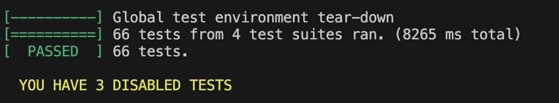

# Logger (C++)

A lightweight, efficient, and easy-to-use logging utility library for C++ projects, developed on C++-20. This logger aims to provide essential logging features with minimal dependencies and overhead, suitable for both small and large scale applications.

## Table of Contents

- [Overview](#overview)
- [Features](#features)
- [Installation](#installation)
- [Configuration](#configuration)
- [Usage](#usages)
- [Tests](#tests)
- [Documentation](#documentation)
- [Extension](#extension)
- [Bonus](#bonus)
- [Contributing](#contributing)
- [License](#license)
- [Contact](#contact)

## Overview

This Logger library offers simple logging capabilities, including multiple log levels, formatted output, and timestamping. It is designed to be lightweight, performant, and straightforward to integrate into any C++ project (min version C++-20) without complicated setup or heavy dependencies. Please note that this currently supports only MacOS and Linux platforms.

## Features

- Multiple log severity levels: ENTRY, EXIT, DEBUG, INFO, WARN, ERROR, ASSERT, FATAL.
- Timestamped logs with configurable time formats.
- Support for console output and file output (either one at a time).
- Customizable log message format.
- Thread-safe logging to prevent message interleaving in multithreaded applications.
- Minimal dependencies — uses only the C++ standard library and fmt for formatting.
- Simple APIs for quick logging.
- Configurable log message format.
- Easy to integrate with existing projects.
- Supports both static and shared library builds.
- In addition you also get a Clock class to get the current time in various formats along with a Timer to measure elapsed time. (optional)
- A FileOps class to handle file operations like reading, writing and many more. (optional)
- A ConsoleOps class to handle logging msgs to console directly. (optional)
- Unit tests using Google Test framework to ensure reliability.

```log
|20250713_180700| 140332865914560| src/ProducerConsumer.cpp|   21|INF>> [virtual void Producer : produce]
|20250713_180700| 140332865914560| src/ProducerConsumer.cpp|   28|INF>  [virtual void Producer : produce] Producer[1] produces data[54] while running in thread 140332865914560
|20250713_180700| 140332840736448| src/ProducerConsumer.cpp|   31|INF<< [virtual void Producer : produce]
```

**Column details:**

| Field            | Description                                               |
|------------------|-----------------------------------------------------------|
| Date Time        | Timestamp when the log entry was generated (e.g., `20250713_180700`) |
| Thread ID        | ID of the thread that produced the log (e.g., `140332865914560`) |
| File Name        | Source file where the log was generated (e.g., `src/ProducerConsumer.cpp`) |
| Line Number      | Line number in the source file that issued the log (e.g., `28`) |
| Log Level        | Severity or level of the log (e.g., `INF/ERR/WARN/FATAL`)               |
| Log Marker       | Additional marker or tag related to log context (e.g., `>>` indicates function/code block entry, `<<` indicates exit, `>` indicates msg) |
| Class & Method   | Class name and method/function name generating the log (e.g., `Producer : produce`) |
| Message          | User-defined log message content                            |

## Installation

### Prerequisits

- C++ compiler supporting `C++-20` (e.g., GCC 10+, Clang 10+)
- make for building the library (currently build process is make based and uses `clang++` for compilation)
- Google Test framework for running tests (optional, but recommended)
- `fmt` library for formatting (if not installed already, it will be downloaded and installed during the build process)

Clone the repository:

`git clone https://github.com/SwarnenduRC/Logger.gitcd Logger`

### Build the library and install (manual)

Run the following commands to build the library:

```bash
make clean
make
```

> **Note**: The library will be built as a static library by default. You can change the `LIB_TYPE` variable in the `makefile` to `shared` if you want to build it as a shared library.
> Release build will be created by default. You can change the `BUILD_TYPE` variable in the `makefile` to `debug` if you want to build it as a debug library. `all` target will build both release and debug libraries.
> By default Tests are not built. You can change the `BUILD_TESTS` variable in the `makefile` to `yes` to build the tests.
> If you want to do this all in one line rather than changing the `makefile`, you can run the following command:

```bash
make clean; make LIB_TYPE=shared BUILD_TYPE=debug BUILD_TESTS=yes
```

#### Install the library

To install the library, run the following commands if you are unsure for now where to install at present:

```bash
# Create target directories if not exist
sudo mkdir -p "$INSTALL_LIB_DIR"
sudo mkdir -p "$INSTALL_INCLUDE_DIR"

# Copy library file recursively
sudo cp -r "$LIB_DIR"/* "$INSTALL_LIB_DIR"

# Copy header files recursively
sudo cp -r "$HEADER_DIR"/* "$INSTALL_INCLUDE_DIR"
```

### Build the library and install (automatic)

You can also run the provided script to install the library automatically:

```bash
./buildNinstall.sh -BUILD_TYPE=release -LIB_TYPE=shared -FILE_LOGGING=yes -LOG_FILE_NAME=IntegrationTesting.log
```

Where `buildNinstall.sh` is a script that will build the library and install it to the default locations. You can also pass the following options to the script:

- `-BUILD_TYPE`: Set the build type (release or debug). Default is release.
- `-LIB_TYPE`: Set the library type (static or shared). Default is static.
- `-FILE_LOGGING`: Enable file logging. Default is no.
- `-LOG_FILE_NAME`: Set the log file name. Default is Logger.log.
- `-BUILD_TESTS`: Enable building tests. Default is no.

> **Note**: The script will automatically download and install the `fmt` library if it is not already installed.
> The default installation locations are:
>
> - Library files: `/usr/local/lib`
> - Header files: `/usr/local/include/logger`

For more details on the script, you can run

```bash
./buildNinstall.sh -h
```

## Configuration

You can configure the logger by modifying the `Logger.h` file or by passing configuration options during build and installation. The logger supports various configuration options such as cconsole logging/file logging, log file name (if file logging is enabled), max log file size, msg format, and more.

Please refer to buildNinstall.sh script for more details on the available configuration options or alternatively run

```bash
./buildNinstall.sh -h
```

## Usages

To use the Logger in your C++ project, follow these steps:

1. Include the header file in your source code:

```cpp
#include <logger/LOGGER_MACROS.hpp>
```

1. Use the logger macros to log messages at different levels in your code. For example:

```cpp
void Consumer::consume()
{
    logger::LOG_ENTRY();
    std::unique_lock<std::mutex> lock(m_mtx);
    m_cv.wait(lock, []{ return !m_dataQueue.empty() || m_isDataReady; });
    m_consumedDataQ.emplace(m_dataQueue.front());
    m_dataQueue.pop();
    std::ostringstream oss;
    oss << std::endl << "Consumer[" << getID() << "] ";
    oss << "consumes data[" << m_consumedDataQ.front() << "] ";
    oss << "while running in thread " << std::this_thread::get_id() << "\n" << std::endl;
    logger::LOG_INFO(oss.str());
    m_consumedDataQ.pop();
    lock.unlock();
    m_cv.notify_all();
    std::this_thread::sleep_for(std::chrono::milliseconds(100));
    logger::LOG_EXIT();
}
```

or

```cpp
TEST_F(LoggerTest, testLogEntryExitWithMsg)
{
    std::cout << std::endl; // Put a line break so that the printed log msg can be seen clearly
    auto logType = static_cast<std::underlying_type_t<LOG_TYPE>>(LOG_TYPE::LOG_INFO);
    LOG_ENTRY("Entering now {} with LOG_TYPE as {:#08x} and log marker as {}", 
        std::string("testLogEntryExitWithMsg"), logType, FORWARD_ANGLES);
    testLoggedData(LOG_TYPE::LOG_INFO, __PRETTY_FUNCTION__, FORWARD_ANGLES);

    LOG_EXIT("Exiting {} with LOG_TYPE as {:#08x} and log marker as {}", 
        std::string("testLogEntryExitWithMsg"), logType, BACKWARD_ANGLES);
    std::cout << std::endl; // Put a line break so that the printed log msg can be seen clearly
    testLoggedData(LOG_TYPE::LOG_INFO, __PRETTY_FUNCTION__, BACKWARD_ANGLES);
}
```

## Tests

The library is having numerous unit test cases which uses `Google Unit test framework`. If you have built the test app too while building then you can run the test cases
by running following command:

```bash
./bin/TestLogger_d --gtest_shuffle --gtest_repeat=3
```

- `--gtest_shuffle` Shuffles the test cases in each iteration (optional)
- `--gtest_repeat=3` Repeats the test cases at least 3 times (optional)



## Documentation

For detailed documentation on the Logger library, including API references, configuration options, and examples, please generate the documentation using Doxygen. You can find the Doxygen configuration file in the root directory of the project.
To generate the documentation, run the following command:

```bash
doxygen Doxyfile
```

The generated `.html` files will be under `docs` folder which also contains a rudimentary class diagram of this library for a quick look.

## Extension

If you want different level/style of logging you can easily extend the code by deriving your own classes from FileOps and/or ConsoleOps.
All the important methods are virtual in nature so that can be easily extended.

## Bonus

Apprat from easy to use logging macros this library also provides three handy classes namely

1. FileOps - For common/standard file related operations like creating a new file, writing it, deleting a file, ammending and many more.
To know how to use that class you can have a look into `FileOpsTest.cpp` under the `test` folder. For example:

```cpp
TEST_F(FileOpsTests, testReadWrite)
{
    std::uintmax_t maxFileSize = 1024 * 1000;
    std::uintmax_t maxTextSize = 255;
    auto fileName = generateRandomFileName();
    FileOps file(maxFileSize, fileName);
    auto text = generateRandomText(maxTextSize);
    file.write(text);
    ASSERT_TRUE(file.fileExists());
    EXPECT_FALSE(file.isEmpty());
    file.readFile();
    auto fileContents = file.getFileContent();
    ASSERT_FALSE(fileContents.empty());
    auto data = fileContents.front();
    EXPECT_EQ(text, data);
    ASSERT_TRUE(file.deleteFile());
}
```

2. ConsoleOps - For writing data into standard console. For example

```cpp
TEST_F(ConsoleOpsTest, testWriteToConsole)
{
    std::uintmax_t maxTextSize = 255;
    auto text = generateRandomText(maxTextSize);
    ConsoleOpsTestClass testObj;
    testObj.setTestingModeOn();
    testObj.write(text);
    auto& result = testObj.getTestStringStreamFromConsole();
    text += "\n";   // A new line character as the outstream object will have one as well
    EXPECT_EQ(text, result.str());
    testObj.setTestingModeOff();
}
```

3. Clock - A utility to perform various clock related ops like getting cuurent local time, GMT time, day of the week etc. For examples:

```cpp
{
    std::string format = "%Y-%m-%d %H:%M:%S";
    auto expLocalTimeStr = clock.getLocalTimeStr(format);
    auto localTime = std::chrono::system_clock::to_time_t(std::chrono::system_clock::now());
    EXPECT_STREQ(expLocalTimeStr.c_str(), formattedLocalTime(format, &localTime).c_str());
}

TEST_F(ClockTests, testGetDayOfWeek)
{
    auto expDayOfWeek = clock.getDayOfWeek();
    auto now = std::chrono::system_clock::to_time_t(std::chrono::system_clock::now());
    auto localTime = std::localtime(&now);
    std::ostringstream oss;
    oss << std::put_time(localTime, "%A");
    EXPECT_STREQ(expDayOfWeek.c_str(), oss.str().c_str());
}q
```

## Contributing

Contributions, issues, and feature requests are welcome! Please follow these steps:

1. Fork this repository.
2. Create a feature branch (`git checkout -b feature-name`).
3. Commit your changes (`git commit -m "Add feature"`).
4. Push to the branch (`git push origin feature-name`).
5. Open a pull request.

Please ensure your code follows consistent style and includes tests where applicable.

> **NOTE:** If you are adding new code then back it by respective test case/s and make sure it doesn't break the existing ones.

## License

This project is licensed under the MIT License - see the [LICENSE](LICENSE) file for details.

## Contact

Maintainer: Swarnendu Roy Chowdhury
GitHub: [SwarnenduRC](https://github.com/SwarnenduRC)

---

*Efficient C++ logging made simple. Feel free to open issues for bugs or feature requests.*
